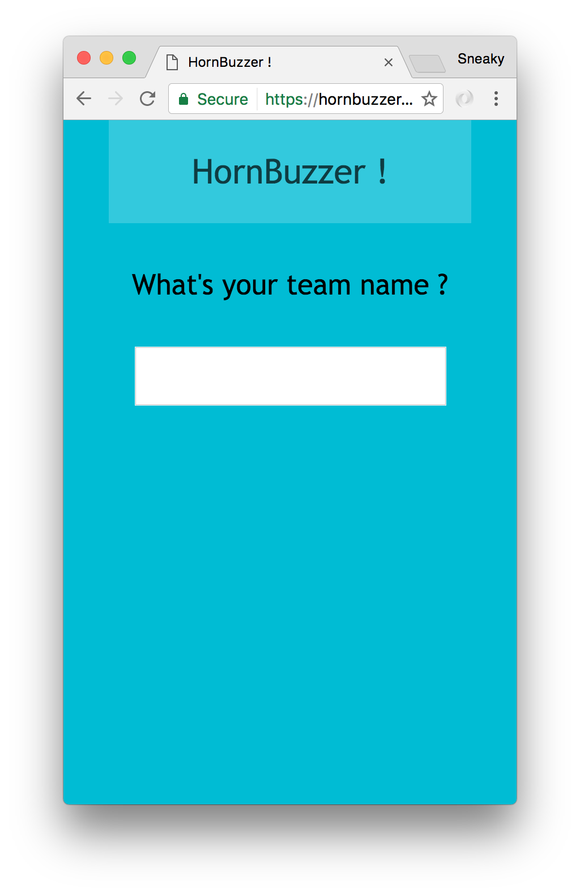
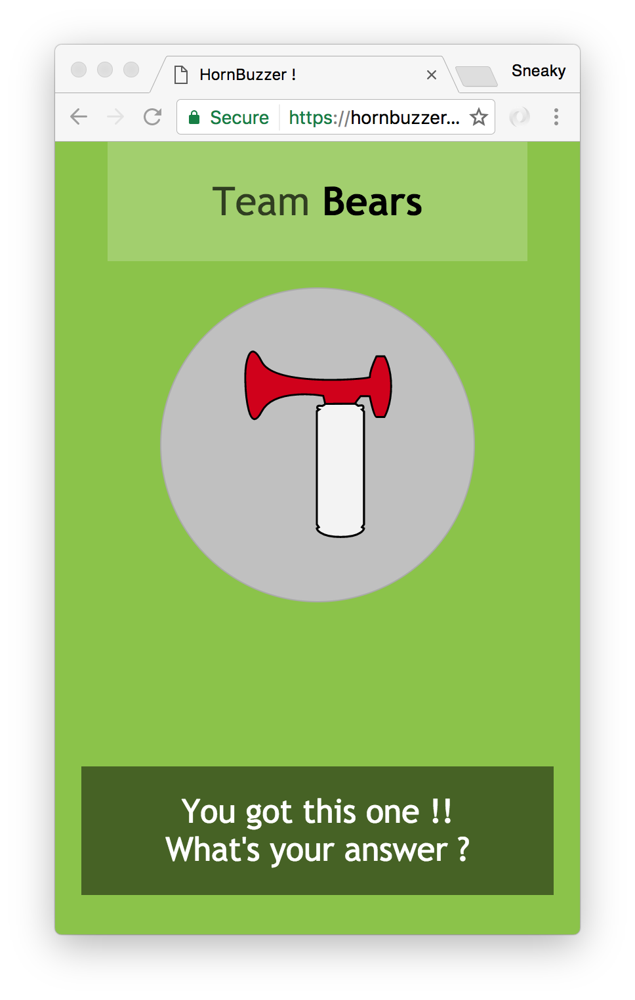
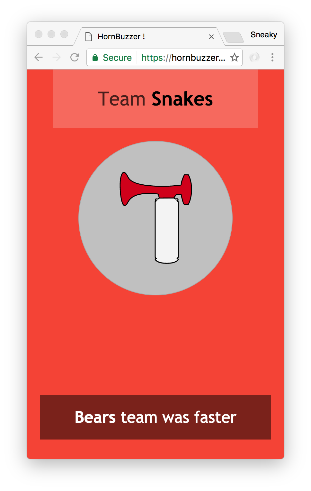
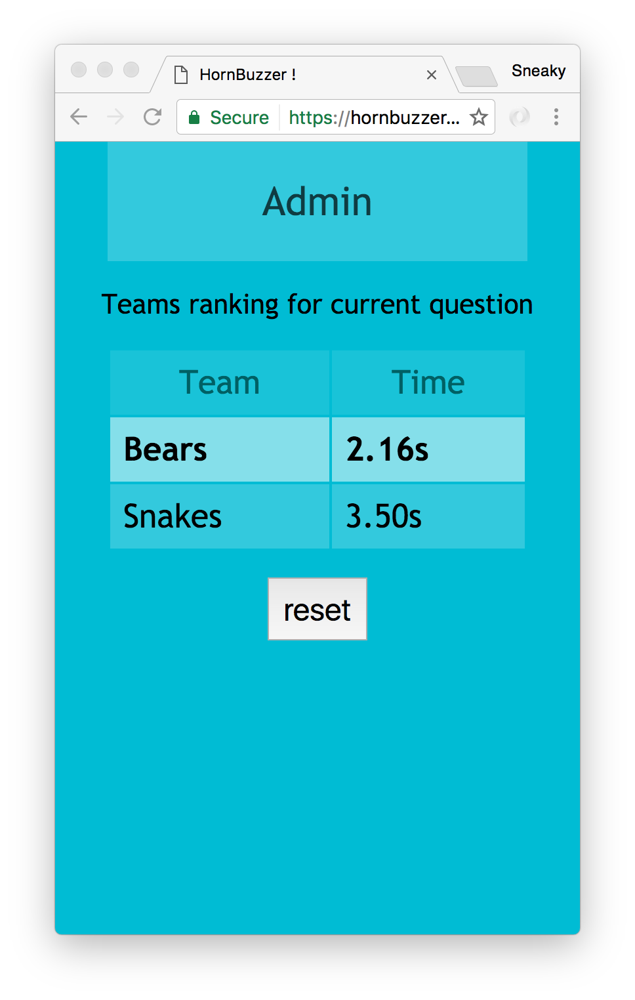

# HornBuzzer
The evil child of an air-horn and a buzzer. Create a dead simple quiz platform. Build in node-js.

This works well on an heroku instance.


## Installing

Works at least from node `v4.4.7`

```
npm install
```

There is nothing to build.

## Running

The server requires you to setup a password in order to protect the admin section.

```
PASSWORD=secretPassword node server.js
```

Get participants to head over to `http://your-heroku-url/` to see the index of the app : 



They'll be redirected to their voting URL `http://your-heroku-url/team/chosenTeamName` there is no limit for participants.

Proceed to ask a question, people will hit the horn win their right to answer ..



or lose if they're too slow



Monitor timing on the admin panel at this URL `http://your-heroku-url/admin/secretPassword` with the password previously setup :



Hit reset to set everyone ready for the next question.

## Gotchas

* Latency, if hosted on free heroku plan
* Requires fresh browsers (use of WebSocket, Audio API, and some other relatively recent CSS and JS features.)